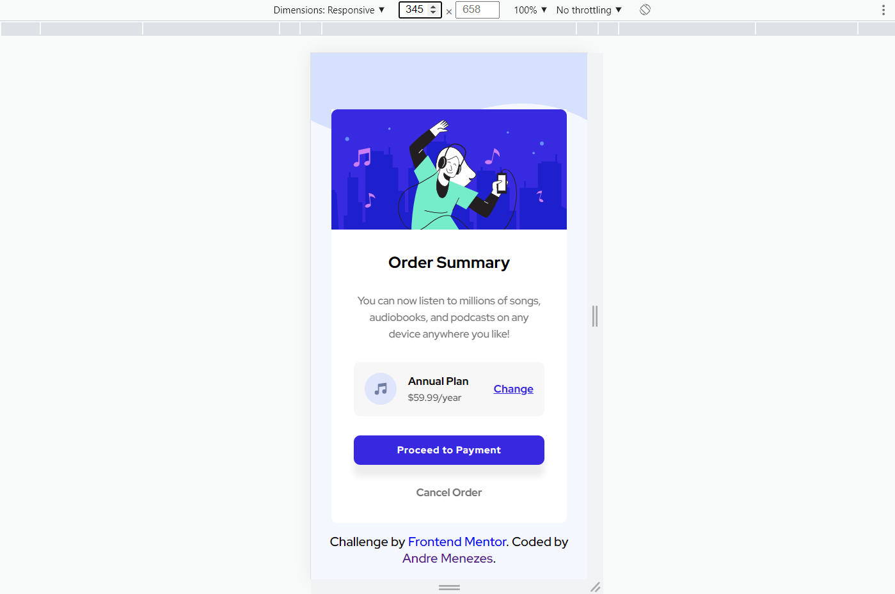
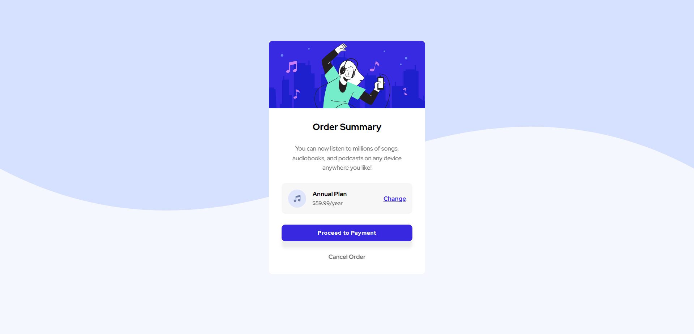

# Frontend Mentor - Order summary card solution

This is a [solution]() to the [Order summary card challenge on Frontend Mentor](https://www.frontendmentor.io/challenges/order-summary-component-QlPmajDUj). Frontend Mentor challenges help you improve your coding skills by building realistic projects.

## Table of contents

- [Overview](#overview)
  - [The challenge](#the-challenge)
  - [Screenshot](#screenshot)
  - [Links](#links)
- [My process](#my-process)
  - [Built with](#built-with)
- [Author](#author)
- [Acknowledgments](#acknowledgments)

**Note: Delete this note and update the table of contents based on what sections you keep.**

## Overview

### Challenge Solutions

#### Mobile

#### Desktop

### Screenshot My Solutions

#### Mobile

#### Desktop

### Links

- Solution URL: [frontend-mentor](https://dedemenezes.github.io/order-component-frontend-mentor/)
- Live Site URL: [gh-pages](https://dedemenezes.github.io/order-component-frontend-mentor/)

### Built with

- Semantic HTML5 markup
- CSS custom properties
- Flexbox
- Styled components

## Author

- Website - [Andre Menezes](https://github.com/dedemenezes)
- Frontend Mentor - [@dedemenezes](https://www.frontendmentor.io/profile/dedemenezes)
- Twitter - [@dedemenezes_](https://www.twitter.com/dedemenezes_)
